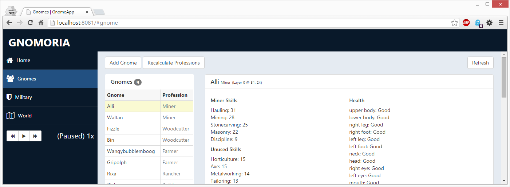

# GnomeServer

This is essentially a port/rewrite of an existing mod for [Cities: Skylines](http://www.citiesskylines.com).

That repository can be found at [Rychard/CityWebServer](https://github.com/Rychard/CityWebServer).



## Notice

While Gnomoria *does* allow modding of the game, the scope of what can be modified is extremely limited, and as far as I can tell doesn't allow for the execution of arbitrary bits of code.  Consequently, the only way I was able to make this work was by modifying the game's executable.  

To perform such a modification, there exists a library ([Mono.Cecil](https://github.com/jbevain/cecil)), which is an extremely powerful library that facilitates this process.  This was my first attempt at using this library, and while I was largely successful in my efforts, I have no idea how likely it is that my assembly modification code will work as-is upon the game's next update.

# Installation

## Server

1. Locate your `Gnomoria` installation directory.
    - Example: `C:\Program Files (x86)\Steam\SteamApps\Common\Gnomoria`

2. Copy the following files **from** your `Gnomoria` installation directory **to** the `Assemblies` directory located in the root of this repository:
    - `Gnomoria.exe`
    - `gnomorialib.dll`
    - `irrKlang.NET4.dll`
    - `SevenZipSharp.dll`

4. Build the `GnomeServer` solution located in this repository using [Visual Studio 2015](https://www.visualstudio.com/en-us/products/visual-studio-community-vs.aspx) (it's free).

5. Copy the files below to your `Gnomoria` installation directory:
  - `GnomoriaInjection\bin\x86\Debug\GnomeServer.dll`
  - `GnomoriaInjection\bin\x86\Debug\GnomoriaInjection.dll`
  - `GnomoriaInjection\bin\x86\Debug\Newtonsoft.Json.dll`
  - `GnomoriaInjection\bin\x86\Debug\TypeLite.dll`
  - `GnomoriaInjection\bin\x86\Debug\GnomeServer.pdb` (Optional)
  - `GnomoriaInjection\bin\x86\Debug\GnomoriaInjection.pdb` (Optional)
  

5. Download [LinqPad](http://www.linqpad.net/) and use it to run the `inject.linq` script located in the `Injector` directory.
    - It's likely that you'll need to edit the first path in that script to point to your `Gnomoria` installation path.
    - This script will create a file called `GnomoriaInjected.exe` in your `Gnomoria` installation path.
    - At the time of writing, this is verified to work on the latest `in-dev` release from Steam, which is `v0.9.18 RC31`.
    - This *may* also work for the current `stable` version of the game on Steam (and perhaps the DRM-free version from Humble Bundle, which I also own, but haven't tested personally).
 
6. Double-click the `GnomoriaInjected.exe` file in your `Gnomoria` installation directory to start the game.

## Website

The server is designed to be flexible, so that *anyone* can build a website that will be hosted by the game.  The server will host anything in the following directory:

    C:\Users\<username>\Documents\My Games\Gnomoria\wwwroot

If any of the following conditions are met, accessing the server will display a "debug mode" page, which displays a list of controllers and their priorities:

- The directory listed above does not exist.
- The directory listed above is empty.
- A request is made for the root-level directory (`/`), but an `index.html` file does not exist.
  - This filename is not editable via the configuration file.
  - Refer to the `IntegratedWebServer.ServiceRoot` method to modify this.

This "feature" allows you to to verify that all request handlers (controllers) have been correctly registered with the server.

In this repository, there exists a project named `GnomeApp`.  This is a website that I've put together during the development of the server.  If you wish to use this website, you'll need to build and deploy it independently of the server.  If you're developing your own website, these steps are not required.

> **Note:** Building this project requires you to have [TypeScript 1.6](http://blogs.msdn.com/b/typescript/archive/2015/09/16/announcing-typescript-1-6.aspx).

1. In the <kbd>Solution Explorer</kbd>, right click on the `GnomeApp\app\models\Interfaces.tt` file, and click <kbd>Run Custom Tool</kbd>.
  - You *must* build the `GnomeServer` project prior to performing this step, as it uses the build artifacts from that project.
  - Failure to perform this step will result in the following compiler warning:

        ```text
        A custom tool 'TextTemplatingFileGenerator' is associated with file 'app\models\Interfaces.tt', but the output of the custom tool was not found in the project.  You may try re-running the custom tool by right-clicking on the file in the Solution Explorer and choosing Run Custom Tool.
        ```

2. In the <kbd>Solution Explorer</kbd>, right click the on the `GnomeApp` project and select <kbd>Publish</kbd>.  
2. Use the following options:
  - Publish method: `File System`
  - Target location: `C:\Users\<username>\Documents\My Games\Gnomoria\wwwroot`
  - Configuration: `Release`

3. Once this is done, ensure that the `C:\Users\<username>\Documents\My Games\Gnomoria\wwwroot` directory exists.

### Advanced Server Configuration
By default, the game hosts a web server that listens for requests at [http://localhost:8081/](http://localhost:8081/)

This address can be configured by editing the server's configuration:
- Install the mod normally.
- Launch `GnomoriaInjected.exe` at least once.
- Close the game.
- Locate the `GnomeServer.json` file.  It is located in the same directory as your saved games.
- Editing the file should be simple enough, but here's a quick sample to illustrate:
```json
[
  {
    "Key": "webServerHost1",
    "Value": "http://<HostName>:<PortNumber>/",
    "Type": "string"
  }
]
```

# Projects

## `GnomeServer`

This project compiles into a single dll (`GnomeServer.dll`).  The `GnomoriaInjection` project has a reference to this project, allowing it to access and spin up an instance of the appropriate code that runs in the same `AppDomain` as the game itself.  Because of this, this assembly has access to the entirety of the game's assembly at runtime, which allows the developer to control large portions of the game's logic.

It's worth noting that this project leverages what is very much a very rudimentary web-server.  While it implements a very respectable amount of features, there's still an immense distance between the one used here and, say, IIS.  Because it was *originally* written for a game written in Unity3D (which runs under Mono), I had to work within the limitations imposed by that platform.  Seeing as how Gnomoria uses XNA (using .NET 4.0) these limitations don't *necessarily* apply, and I could have dropped in an ASP.NET Self-Host platform.  That said, I chose not to simply because I would be unable to use the latest version, since that platform has long-since moved forward to more recent releases of the .NET framework.

Despite these "limitations", one of my design goals was to reduce the most tedious part of working with the previous version of the web server used for the Cities: Skylines mod: the creation of new endpoints.  During my "9 to 5" I do a lot of work using the latest-and-greatest versions of ASP.NET MVC/WebAPI and one of the most missed parts of that is [Attribute Routing](http://blogs.msdn.com/b/webdev/archive/2013/10/17/attribute-routing-in-asp-net-mvc-5.aspx).

Seeing as how the ASP.NET team has recently [open-sourced the code for this project](https://github.com/ASP-NET-MVC/aspnetwebstack), I briefly considered pulling out some of the relevant bits and pieces for use in this project.  That idea was short-lived, as I came to my senses and realized that this code is *very* feature-rich, and this comes at the cost of some rather *lengthy* code.  Instead of grabbing a *few dozen* files and spending countless hours trying to get it to work with this project, I decided to implement my own (admittedly very limited) version of this feature.  It should feel *somewhat* similar to those familiar with the official solution, but there are some remaining issues with it and it's certainly not what I'd call a "complete" product.


## `GnomoriaInjection`

This project compiles into a single dll (`GnomoriaInjection.dll`) that acts as the receiving end of the hook.  At some point after the game's executable is launched, a call is made to the `getter` of the `GnomanEmpire.Instance` property.  This seems to be a reliable location to inject code into the game, though care must be taken to ensure that code is not injected multiple times, as this property is accessed quite frequently throughout the normal execution of the game.

## `GnomeApp`

The server *does* include a website by default, but the built-in site is extremely rudimentary and largely useless for anything other than development of the server itself.

Because the utility of the server is largely dependent upon the existence of a website to host, this project exists to provide a working model of a website that exposes much of the functionality exposed by the server.

This project is a JavaScript SPA (Single-Page Application), the bulk of which is written in [TypeScript](http://www.typescriptlang.org/).  This is subsequently transpiled into JavaScript, where it leverages a variety of JavaScript libraries, such as [Durandal](http://durandaljs.com/), [Knockout](http://knockoutjs.com/), [RequireJS](http://requirejs.org/), and [jQuery](https://jquery.com/).

Also contained in this project are TypeScript interfaces that are generated dynamically from C# class definitions in the `GnomeServer` project.  This is accomplished through the very useful [TypeLite](http://type.litesolutions.net/) library.

# Questions?

Create an issue on this repository and I'll see what I can do to help.

# Attribution

The design of GnomeApp is based on the "Dream" template from [WebThemez](http://webthemez.com/free-bootstrap-admin-template-dream/)
